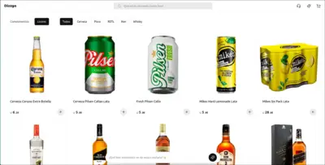
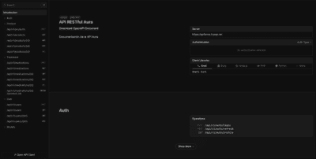

  <ul align="center">
    
<h1 style="display: inline-block">Hi 👋, I'm Henry</h1>

  </ul>

  

  <ul align="center">
    
<h2 style="display: inline-block">Confusion is part of programming</h2>

  </ul>

## What i'm doing
- 👨‍🎓 Graduate of the professional career in Computer and Systems Engineering.
- 👯 I am a collaborator in micro-enterprises.
- 📫 How to reach me: Ghreengate@gmail.com
- ​😎 I’m passionate about specializing as a back-end developer.

## Some projects👨🏻‍💻

<table align="left" align="center">
<tr border="none">
  <td width="32%" align="center">
    

        
    

    

    Collaborators ...
      
      
    

  </td>
  <td width="32%" align="center">
    

        
    

    

    Collaborators ...
        
        
        
        
         
    

  </td>
  <td width="32%" align="center">
    

        
    

    

    Collaborators ...
        
    

  </td>
</tr>
</table>

 
  

    <ul align="center">
      
<h2>Languages and tools 👨🏻‍💻</h2>

    </ul>
  

  <h3>Languages</h3>
    

      
    

  <h3>Frameworks, IDEs and Libraries</h3>
      

        
      

  <h3>Others</h3>
      

        
      

 

## Activity on github

   

## My stats

  <a href="https://github.com/Lionous"> 
    
    

## Connect with me
<h5 align="center">Below are some links you can visit and follow me.</h5>

   
  
  
  
 

---

Last updated on: 19-08-2026
